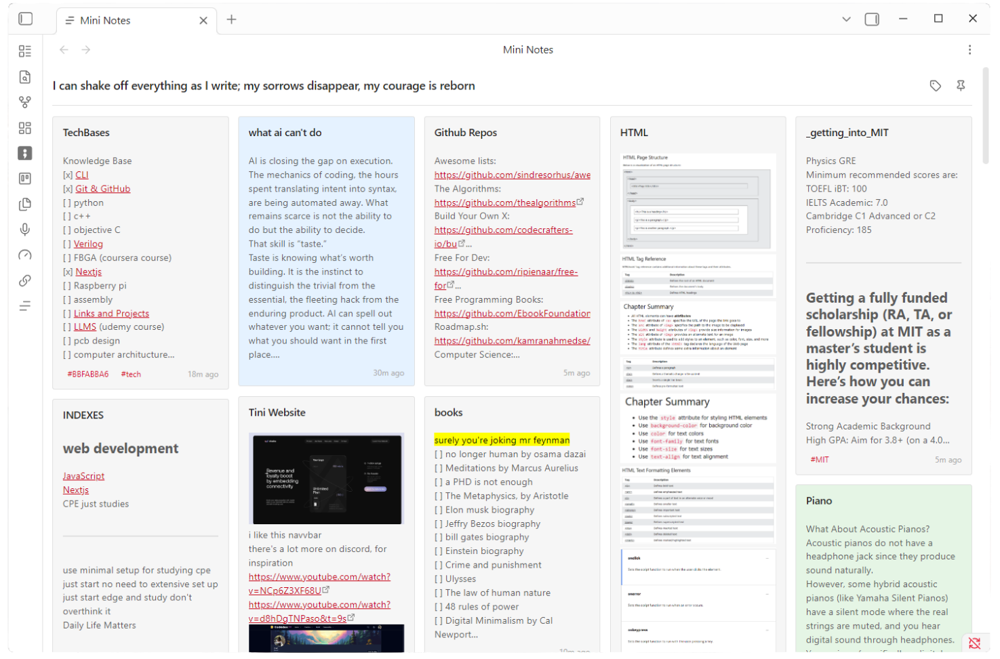
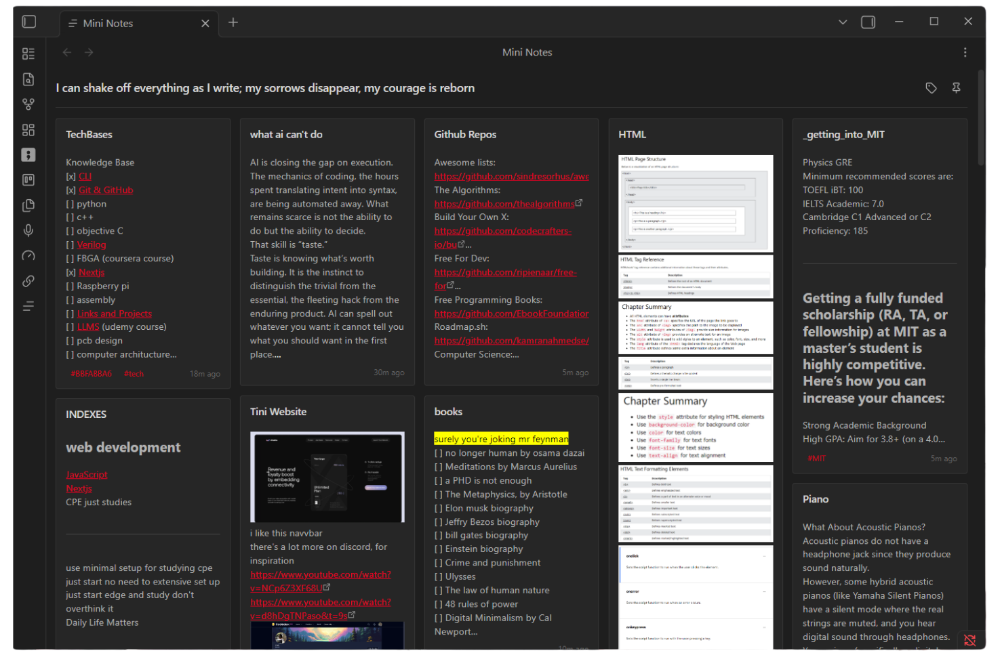
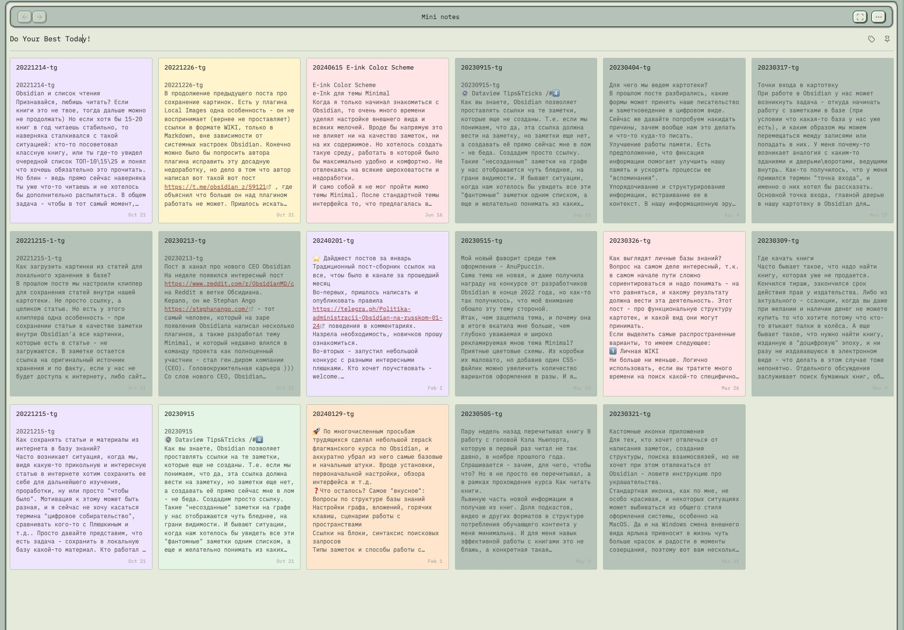

# Mini Notes
Your quick thoughts, beautifully displayed, without worrying about organization.
Review them later in a colorful Google Keep-style card-based view, where you can pin, tag, and arrange what matters.

- view your notes in a google keep-notes similar layout
- change the bg color of your notes!
- pin your most important notes
- filter your notes based on their tags, folder, color, type.
	- **Example:**    `folder:projects`  `color:yellow`   `tag:cs`

<!-- **Light Theme** -->

<!-- **Dark Theme** -->

**Aligns with whatever theme you have!**

### **IOS & Android Mobile Support**

---
**Coloring Notes:**  Hover on a note >> select the color you want.

---

### Creating a New Mini Note
- Click on the icon in the cards view
- Search for "Mini Notes: Create new mini note"
- Notes are created in the "Mini Notes" folder by default (configurable in settings)
- Recommended Hotkey: `Ctrl + [`

### Opening the Cards View
- Click the grid icon in the left ribbon, or
- Search for "Mini Notes: Open view"
- The view will intially load all notes (configurable in settings)
- Recommended Hotkey: `Ctrl + ]`

### Customizing the View
- Edit the title by clicking on it directly
- Drag cards to reorder them
- **Settings → Mini Notes** to configure:
  - Source folder (where notes are fetched from)
  - Create folder (where new mini notes will be saved)
  - Maximum notes to display (default: 150)
  - Theme color preferences

### Filtering: within the search bar
- search for normal text, using the smart search or
- filter by: **(folder:, tag:, color:, type:, is:, has:)**
	- `folder:` and see all available folders
	- `tag:` and see all available tags
	- `color:` and see all color options
	- `type:` and see all content type options
	- `is`: is:pinned or is:unpinned

Don't forget to give it a ⭐ on [GitHub](https://github.com/rknastenka/mini-notes) to help others discover it!

---

If you find Mini Notes helpful, please consider supporting my work!

